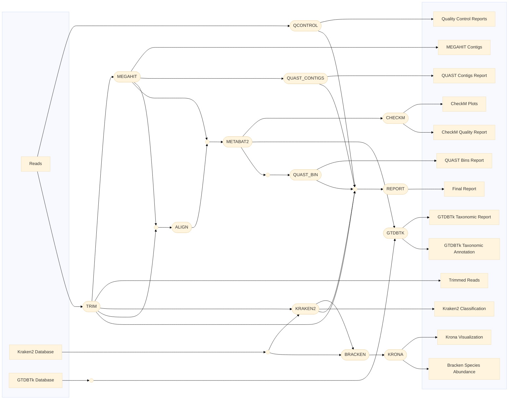

# metagenome_nf
Nextflow-based pipeline for metagenome analysis
[Instruction](https://docs.google.com/document/d/1h06RVDIZ1f9xQbnKjONFoMILpTTpqJHdfO36oNLmpps/edit?usp=sharing)


## Description

This pipeline is implemented in Nextflow and includes several stages for metagenomic data analysis:

- **QCONTROL (FastQC)**: Quality control of raw sequencing data using FastQC.
- **TRIM (fastp)**: Trimming of reads to remove adapters and low-quality sequences using fastp.
- **KRAKEN2 (Kraken2)**: Taxonomic classification of reads using Kraken2.
- **BRACKEN (Bracken)**: Estimation of species abundance based on Kraken2 outputs using Bracken.
- **MEGAHIT (MEGAHIT)**: Assembly of metagenomic sequences using MEGAHIT.
- **ALIGN (bwa)**: Alignment of reads to the assembled contigs using BWA MEM.
- **METABAT (MetaBAT2)**: Binning of assembled contigs into metagenomic bins using MetaBAT2.
- **QUAST_CONTIGS (QUAST)**: Quality assessment of assembled contigs using QUAST.
- **QUAST_BIN (QUAST)**: Quality assessment of each bin using QUAST.
- **CHECKM (CheckM)**: Quality assessment and visualization of metagenomic bins using CheckM.
- **GTDBTK (GTDBTk)**: Taxonomic annotation of bins GTDBTk.
- **REPORT (MultiQC)**: Compilation of a comprehensive report including QC metrics, taxonomic classification, and assembly results.

## Usage

### Quick Start

To quickly run the pipeline, use the following command:

```bash
nextflow run <your-username>/<your-repository> \
    -profile <docker/singularity> \
    --reads <path-to-reads-folder> \
    --kraken2_db <path-to-kraken2-database> \
    --outdir <path-to-results-folder>
```

### Requirements

- Nextflow (https://www.nextflow.io/docs/latest/install.html)
- Docker (https://docs.docker.com/engine/install/) or
- Singularity (https://github.com/sylabs/singularity/blob/main/INSTALL.md)

### Running the Pipeline

1. Install all the necessary dependencies such as Nextflow, Singularity.
3. Clone this repository: `git clone https://github.com/glebus-sasha/metagenome_nf.git`
4. Navigate to the pipeline directory: `cd octopus_nf`
5. Edit the `nextflow.config` file to set the required parameters, if necessary.
6. Run the pipeline, setting the required parameters, for example:

```bash
nextflow run main.nf
```
## Contributors

- Oxana Kolpakova ([@OxanaKolpakova](https://github.com/OxanaKolpakova))
- Glebus Aleksandr ([@glebus-sasha](https://github.com/glebus-sasha/))

## License

This project is licensed under the [MIT License](LICENSE).
